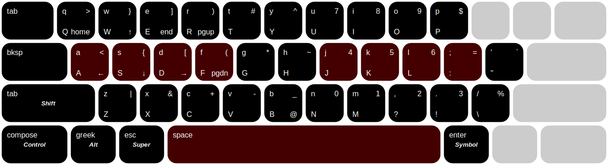

# thumbledore

*A software-based keyboard layout. Have each finger travel one key at most, and let your thumbs pick up the slack.*

The layout of the standard keyboard is hardly optimal. The most glaring problem is, in my opinion, that your thumbs idle while your weakest finger contorts to reach keys like `bksp`. Although I have been enticed by exotic keyboards like the Kinesis Advantage, what has held me back is portability: to avoid upsetting your muscle memory, you'd have to lug around a secondary keyboard wherever you go. Besides — let's not chuck any electronics in the landfill.

Within the constraints imposed on us by the standard keyboard, `thumbledore` adds the following tweaks that put your thumbs to work:

1. `alt_l` switches places with `super`. The key where `alt_l` once was becomes multifunctional:

    -   Tapping it triggers `esc`. Especially useful for modal applications like vim.

    -   While holding it, you get a *navigational layer* in the top right cluster of keys (QWER/ASDF): arrows, `home`/`end`, and `pageup`/`pagedn`. It is placed so that you can control it with one hand.

    -   Combining it with any other key makes it act like a `super` modifier. This is convenient for controlling a window manager: it's the one key for all non-application-specific keybindings that you might want to set. For example, I set `super`+{`h`,`l`} for switching workspaces and `super`+{`j`,`k`} for switching windows.

2. `alt_r` becomes similarly multifunctional:

    -   Tapping it triggers `enter`, the logical counterpart to `esc`.

    -   Holding it exposes a *symbol layer*. This layer contains a numpad --- also placed so that it can be controlled with one hand --- and other symbols in easier-to-reach locations. In particular, brackets are on the left-hand home row.

3.  When `alt_l` and `alt_r` are held simultaneously, it acts the same as `super`+`shift`. This is so that you may bind `super`+`shift` to actions logically related to non-shifted counterparts. For example, I set `super`+`shift`+{`h`,`l`} for *sending to* workspaces and `super`+`shift`+{`j`,`k`} for *swapping* focused windows.

4.  `caps` becomes `bksp`, avoiding the huge move your pinky would otherwise have to make. (I know that this is also a popular spot for the `ctrl` or `esc` keys, but for thematic consistency, those get handled by your thumbs. `bksp` now gets an intuitive spot to the left of the keys that could be backspaced.)

5.  Additionally, tapping `ctrl` triggers the `compose` dead key. This way, you would type special characters by typing intuitive keys in succession (e.g. `" + e` → `ë`). See the compose table at `/usr/share/X11/locale/$LANG/Compose`. Tapping `alt` triggers the `dead_greek`, which does a similar thing for Greek characters (e.g. `f` → `φ`).

This has the following benefits:

-   Each key is accessible by moving your finger(s) *at most one key away*. No more fumbling around for special symbols and function keys.
-   *Simple*: There are only two additional layers involved: one controlled by your left and the other by your right thumb.
-   Only uses *standard tools*. The tweaks I propose here could also be achieved with the excellent [kmonad](github.com/david-janssen/kmonad), but that approach — while certainly easier to understand once it is up and running — isn't as plug-and-play.
-   Achievable using *any run-of-the-mill keyboard*.
-   It *degrades gracefully*: even when you do have a good keyboard, you can keep the layout somewhat consistent if you're forced to work on another.  In particular, if you have a split spacebar, you could put `shift`/`tab` on the other space and keep everything else as it is. I also tried to make sure that users of a Corne or similar keyboard could additionally put `alt`/`dead_greek` and `ctrl`/`compose` on the two extra thumb keys.

## Usage

To install, make sure that you have `xcape` and the `xkb` utilities. On Debian-derived systems:

    sudo apt install x11-xkb-utils xcape

Then, simply run `thumbledore` at startup.

## Related software

-   [hawck](https://github.com/snyball/Hawck)
-   [kmonad](https://github.com/david-janssen/kmonad)
-   [xkeysnail](https://github.com/mooz/xkeysnail)
-   [keyd](https://github.com/rvaiya/keyd)
-   [xcape](https://github.com/alols/xcape)
-   [caps2esc](https://gitlab.com/interception/linux/plugins/caps2esc)
-   [space2ctrl](https://github.com/r0adrunner/Space2Ctrl)
-   [klfc](https://github.com/39aldo39/klfc)
-   [keynav](https://www.semicomplete.com/projects/keynav/)
-   [map2](https://github.com/shiro/map2)
-   [at-home-modifier-evdev](https://gitlab.com/at-home-modifier/at-home-modifier-evdev)
-   [evscript](https://github.com/unrelentingtech/evscript)
-   [evcape](https://github.com/wbolster/evcape)
-   [ergo](https://github.com/lcarsos/ergo)

Check out `/usr/share/X11/xkb` for codes and `/usr/include/X11/keysymdef.h` (from `x11proto-dev`) for symbols. Use `xev` for inspection. Use `xmodmap` to see which modifiers are bound to which keys.

## Related reading

-   <https://wiki.archlinux.org/index.php/X_keyboard_extension>
-   <https://www.charvolant.org/doug/xkb/>
-   <https://www.x.org/releases/X11R7.7/doc/xorg-docs/input/XKB-Enhancing.html>
-   <http://www.pixelbeat.org/docs/xkb_remap/>
-   It's a bit radical, but perhaps a good idea to move around the alphabetic keys themselves. I'm enamoured by the <https://workmanlayout.org/> and will experiment with it later.
