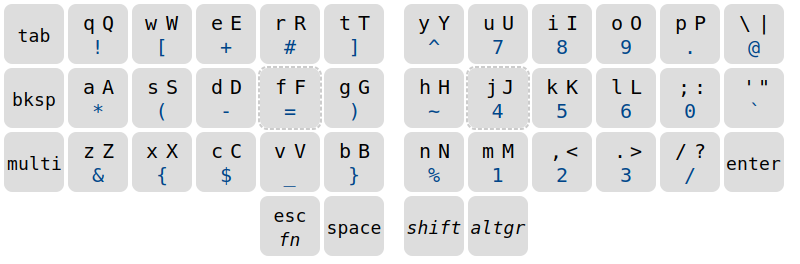
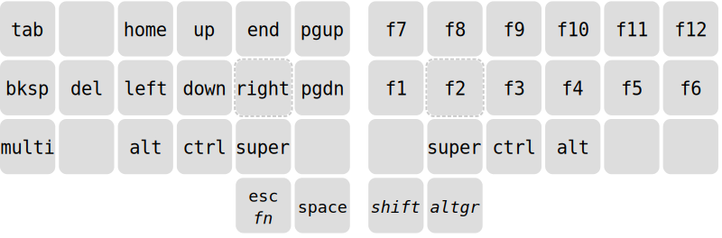

# Thumbledore

*I only uploaded this so that it may serve as inspiration. It is still 
being tweaked. Thumbledore currently only supports Linux.*

Touch typing on a standard keyboard is not a great experience. Your 
thumbs idle while your weakest finger contorts to reach keys like 
<kbd>Esc</kbd> and <kbd>BackSpace</kbd>. Numbers and other common 
symbols require you to abandon a comfortable hand position entirely. 
Exotic keyboards can remedy all this, but lack portability.

Thumbledore is a keyboard layout that works well for fancy keyboards 
with 2 or more thumb keys per hand, but that *also* fits broadly within 
the constraints of a laptop keyboard.

-   **Each finger travels one key at most.** Your thumbs pick up the slack.
-   **Easy to remember.** All symbols are accessible with just the 
    normal <kbd>Shift</kbd> and <kbd>AltGr</kbd> modifiers. There is 
    only *one* additional *Action* layer for navigation/function keys 
    --- and that's it. No crazy combinations.
-   **One-handed control.** The number pad can be operated with just the 
    right hand. Navigation keys and the `control+{z,x,c,v,s}` shortcuts 
    can be reached with just the left.
-   **Graceful degradation.** You can keep a somewhat consistent layout 
    even when you're stuck on a mainstream keyboard. Only 
    <kbd>Compose</kbd> and <kbd>Shift</kbd> are in a truly different 
    spot.
-   **Progressive learning.** You don't need to learn everything all at 
    once. I've found the <kbd>AltGr</kbd> symbols to be the most 
    ergonomically significant, so start with that.
-   **Regressions are avoided.** When stuffing so much functionality in 
    a limited area, it is inevitable that some key events will become 
    harder to generate. However, care has been taken to make as few 
    assumptions as possible:
    -   No reasonable shortcut should be impossible or cumbersome to 
        type. For example, pulling up the application menu or escaping a 
        virtual machine often involves tapping a modifier on its own --- 
        you should be able to.
    -   Modifiers should still stack in a sensible, consistent and 
        intuitive way. If a program wants you to press, say, 
        `control`-`alt`-`1` for some purpose or other, the user should 
        not be confused as to how to achieve that.
-   **No homerow mods.** While typing at speed, keypresses will often 
    overlap, which means that any attempted overload of alpha keys must 
    resort to timeouts. This introduces [visual delay][pftwp] and can 
    cause misfiring. There are [ways][urob] to mitigate it and train 
    yourself to work with it, but I have not made that sacrifice here.
-   **Overloading is used sparingly.** Even on non-alpha keys, 
    overloading has the above downsides, albeit to a lesser degree. 
    Therefore, only *one* key has been overloaded: the Action key 
    doubles as <kbd>Esc</kbd> when tapped. <!-- This is considered safe 
    because the key is not associated with a modifier, and the `esc` is 
    only registered when the tap is shorter than *x* milliseconds. -->

## Symbols

Are you currently using a US Qwerty layout or similar? Then there isn't 
much of a barrier to entry: in Thumbledore's Qwerty variant, all 
characters stay in the same place. The major addition is that the 
Level-3 symbols (which can be accessed by the AltGr modifier) have been 
crammed full with numbers and other symbols for which you would normally 
have had to abandon the standard hand position.

<!-- Symbols were placed according to how often I personally need them, 
drawing inspiration from the [Workman] layout on which keys to assign 
preference.

Because AltGr is pressed with your right-hand thumb, the left-hand side 
of the keyboard is preferred for things like parentheses, while the 
number pad can now be controlled entirely with your right-hand. -->

- <kbd>BackSpace</kbd> is put in the place of <kbd>CapsLock</kbd>, 
  avoiding the huge move your pinky would have made.

- <kbd>Shift</kbd> and <kbd>AltGr</kbd> are modifiers, but unlike 
  <kbd>Control</kbd> and <kbd>Alt</kbd>, they don't provide shortcuts 
  --- they simply access more symbols. To make for a more comfortable 
  typing experience, these these keys are made *sticky* (or *oneshot*). 
  This removes the need to consciously wait to release the modifier in 
  the short interval *after* pressing the key to be modified but 
  *before* the next one. MUch better!

- You will often need a decimal point while typing numbers, but it is 
  cumbersome to exit the numpad just to grab one and come back. For this 
  reason, if you are typing a number and release and then immediately 
  press AltGr again, a `.` or `,` will be emitted (depending on your 
  layout).

- The *compose* (or *multi*) key allows you to type special characters 
  by typing intuitive keys in succession. For example,  
  <kbd>Multi</kbd><kbd>C</kbd><kbd>=</kbd> becomes `€`.

## Action

<kbd>Escape</kbd> is given an easily accessible spot, since it is useful 
for modal applications like Vim.

The remaining keys are hidden in the *Action* layer, which can be 
accessed by *holding* instead of tapping <kbd>Escape</kbd>. This layer 
contains a navigation cluster on the left, placed so that you can 
control the directional keys with one hand.

The other modifiers are also available here: tapping the keys labeled 
<kbd>Alt</kbd>, <kbd>Ctrl</kbd> and <kbd>OS</kbd> activates the 
corresponding modifiers for the remainder of the time that *Action* is 
active.

Finally, the layer has the *function keys*. This is convenient for quick 
access to window-manager shortcuts that you might want to set, such as 
navigating desktops and closing windows.

# Technical considerations

When you press a key, your keyboard will send a *scancode* to the 
computer; the kernel maps that to a *keycode*; and finally, your 
keyboard layout considers that keycode (along with the active modifiers) 
and emits a *keysym*.

Thumbledore remaps *symbols* at this keysym level, while other keys are 
mapped at the scan- or keycode-level. Teasing the two apart like this 
has several benefits:

- At the scan- and keycode-level, more tricks can be applied, like 
  overloading.
- Your operating system knows what symbol layout you are using, and you 
  can switch between them in the standard way.
- Users can try the <kbd>AltGr</kbd> symbols, without committing to the 
  rest.
- All keyboards, regardless of firmware, will type the same symbols.
- It becomes easier to reason to reason about composition: we don't have 
  to explicitly write rules for how the various layers and modifiers 
  combine. Suppose, for example, you want to zoom in with 
  <kbd>Ctrl</kbd><kbd>+</kbd> --- your muscle memory will know that 
  <kbd>AltGr</kbd><kbd>e</kbd<kbd>AltGr</kbd><kbd>e</kbd>> is `+`, so 
  you have your keyboard send 
  <kbd>AltGr</kbd><kbd>Ctrl</kbd><kbd>e</kbd>, and your programs will 
  hear <kbd>Ctrl</kbd><kbd>+</kbd>.
- You are able to choose the decimal point `.` or `,` at the layout 
  level.

## Usage and installation

Install [keyd](https://github.com/rvaiya/keyd) (version >=2.3) and run 
`sudo make install`. Activate the `thumbledore` layout in your 
environment.

<!--
## Other

[Seniply] and [Callum] have similar goals: limited keys and no home-row 
mods.

# Consideration for the thumb keys

-   All thumb keys except space are modifiers or layer keys, because you 
    have full range of motion with the rest of your fingers while 
    holding them.
-   Since we avoid crazy modifier combinations, `sym` and `shift` never 
    make sense to press together. Therefore, they should be on the same 
    finger.
-   `space` should be opposite from  `shift` and `sym`, so that you can 
    still use it while in their respective modes.

-->

<!-- Reading -->
[Preconditions-Guide]: https://precondition.github.io/home-row-mods
[Urob]: https://github.com/urob/zmk-config#timeless-homerow-mods
<!-- About visual latency -->
[pftwp]: https://pavelfatin.com/typing-with-pleasure/#human-side

<!-- Layouts -->
[Colemak-DH]: https://colemakmods.github.io/mod-dh/
[Workman]: https://workmanlayout.org/

<!-- More layouts -->
[Seniply]: https://stevep99.github.io/seniply/
[Callum]: https://github.com/callum-oakley/qmk_firmware/tree/master/users/callum
[Miryoku]: https://github.com/manna-harbour/miryoku
